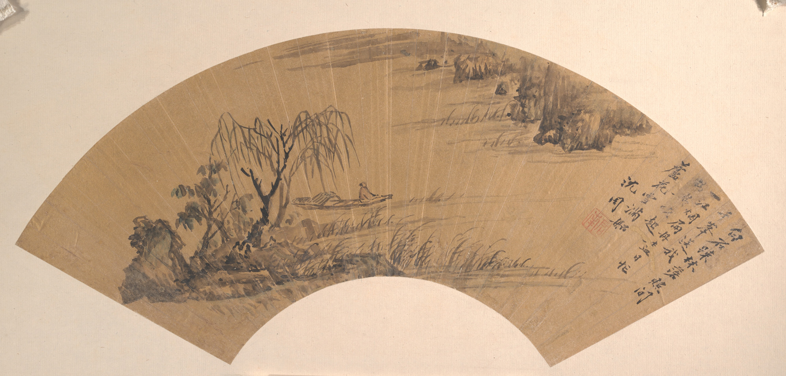
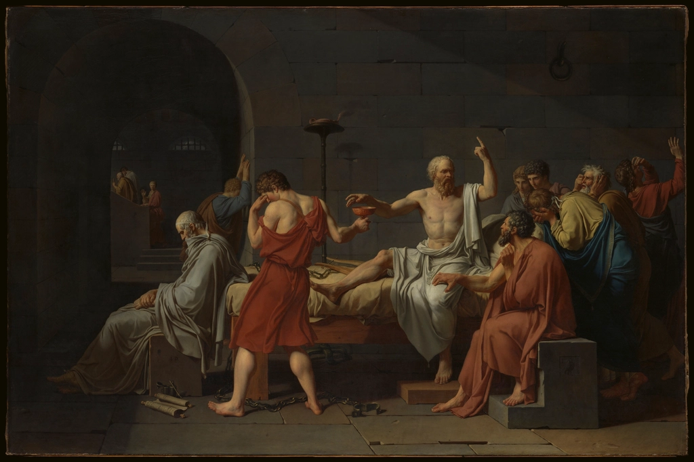
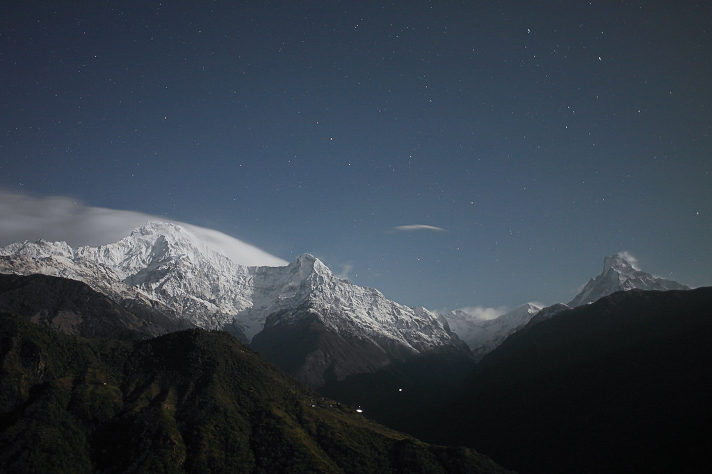

# Matt Pic Grab Image

[English](README.md) | [简体中文](README.zh-CN.md)

Find a **commercial-use, editable, no-attribution-required** image by keyword or at random, then save the image locally with its source page, license metadata, and risk notes.

The default mode is `strict_cc0`: it prioritizes CC0 / Public Domain sources and does not mislabel Pexels, Pixabay, or Unsplash platform licenses as CC0.



## Who This Is For

- Writers, creators, and builders who need a usable image for covers, social posts, and article illustrations.
- Codex users who want one prompt to return an image URL, local file path, source page, license, and risk flags.
- Anyone who wants to separate "free commercial use" from true CC0 / Public Domain sourcing.
- People who need reusable local image caches with metadata, not just one-off hotlinks.

## What You Get

Each run returns:

- High-resolution image URL
- Local cached file path
- Source page URL
- License name and license URL
- Creator, collection, or source metadata
- Risk flags such as recognizable people, trademarks, or Openverse aggregation
- A metadata JSON file for later citation and review

Important output fields:

```json
{
  "provider": "met",
  "title": "Landscape",
  "creator": "Unidentified artist",
  "image_url": "https://images.metmuseum.org/CRDImages/as/original/DP156857.jpg",
  "source_url": "https://www.metmuseum.org/art/collection/search/51378",
  "license": "CC0 / Public Domain",
  "local_path": "~/.cache/matt-pic-grab-image/images/met/51378-Landscape.jpg",
  "metadata_path": "~/.cache/matt-pic-grab-image/meta/met-51378.json",
  "risk_flags": []
}
```

## Install

Download or clone this repository, then run this from the repository root:

```bash
mkdir -p "${CODEX_HOME:-$HOME/.codex}/skills"
ln -s "$PWD/skills/matt-pic-grab-image" "${CODEX_HOME:-$HOME/.codex}/skills/matt-pic-grab-image"
```

You also need Bun:

```bash
bun --version
```

## Use With Codex

Ask in natural language:

```text
Use $matt-pic-grab-image to find a CC0 history painting for an article cover.
```

```text
Use $matt-pic-grab-image to find a random commercially usable nature background and save it locally.
```

Chinese prompts work well too:

```text
使用 $matt-pic-grab-image 给我一张“山水”主题图片，要求免费商用、无需署名、可二改
```

Codex will preserve the original query and add a concise English fallback when useful.

## Use From The Command Line

Chinese landscape:

```bash
bun run skills/matt-pic-grab-image/scripts/grab-image.ts \
  --query "山水" \
  --fallback-query "Chinese landscape painting" \
  --mode strict_cc0 \
  --provider met,openverse \
  --orientation landscape \
  --count 1 \
  --seed shanshui-commercial-safe
```

History painting:

```bash
bun run skills/matt-pic-grab-image/scripts/grab-image.ts \
  --query "history painting" \
  --mode strict_cc0 \
  --orientation landscape \
  --count 1
```

Random background:

```bash
bun run skills/matt-pic-grab-image/scripts/grab-image.ts \
  --random \
  --mode strict_cc0 \
  --orientation landscape
```

Return URL and metadata only, without downloading:

```bash
bun run skills/matt-pic-grab-image/scripts/grab-image.ts \
  --query "botanical illustration" \
  --mode strict_cc0 \
  --no-download
```

Package shortcuts:

```bash
bun run pic:shanshui
bun run pic:history
bun run pic:random
```

## Examples

| Skill | Use Case | Prompt / Command | Result | License Trail |
| --- | --- | --- | --- | --- |
| `matt-pic-grab-image` | Chinese landscape image | `使用 $matt-pic-grab-image 给我一张“山水”主题图片，要求免费商用、无需署名、可二改` |  | `CC0 / Public Domain`<br>The Metropolitan Museum of Art Open Access<br>`risk_flags: []` |
| `matt-pic-grab-image` | Historical article cover | `Use $matt-pic-grab-image to find a CC0 historical painting for a cover.` |  | `CC0` via Openverse metadata<br>Source URL preserved for review |
| `matt-pic-grab-image` | Random nature background | `bun run pic:random` |  | `CC0` via Openverse metadata<br>Local cache and metadata saved |

## License Modes

### `strict_cc0`

Default mode. Use this when copyright safety matters most.

Sources:

- Openverse: filtered to `license=cc0`
- The Met Open Access: filtered to `isPublicDomain=true`
- Smithsonian Open Access: optional, requires `SMITHSONIAN_API_KEY`

### `stock_beauty`

Use only when you explicitly accept platform stock licenses. This mode can produce more modern stock-photo aesthetics, but it is not CC0.

```bash
bun run skills/matt-pic-grab-image/scripts/grab-image.ts \
  --query "workspace" \
  --mode stock_beauty \
  --provider pexels,pixabay \
  --orientation landscape
```

Required keys:

```bash
PEXELS_API_KEY=
PIXABAY_API_KEY=
```

Results are labeled as `Pexels License` or `Pixabay Content License`, never as CC0.

## Options

| Option | Description |
| --- | --- |
| `--query "text"` | Search keyword |
| `--fallback-query "text"` | Repeatable fallback query |
| `--random` | Pick from safe broad subjects |
| `--mode strict_cc0\|stock_beauty` | License mode, default `strict_cc0` |
| `--provider openverse,met` | Override provider order |
| `--orientation landscape` | Landscape image |
| `--orientation portrait` | Portrait image |
| `--orientation square` | Square image |
| `--orientation any` | No orientation filter |
| `--count 1` | Number of results, 1 to 10 |
| `--cache-dir PATH` | Custom cache directory |
| `--no-download` | Return URL and metadata without saving the image |
| `--seed VALUE` | Make random/provider choices repeatable |

## Cache

Default cache directory:

```text
~/.cache/matt-pic-grab-image
```

Images:

```text
~/.cache/matt-pic-grab-image/images/{provider}/...
```

Metadata:

```text
~/.cache/matt-pic-grab-image/meta/{provider}-{id}.json
```

Override it with:

```bash
export MATT_PIC_GRAB_CACHE_DIR="/your/cache/path"
```

## Optional API Keys

Openverse and The Met work without keys by default.

For heavier usage or optional providers:

```bash
cp .env.example .env
```

Supported variables:

- `OPENVERSE_CLIENT_ID`
- `OPENVERSE_CLIENT_SECRET`
- `SMITHSONIAN_API_KEY`
- `PEXELS_API_KEY`
- `PIXABAY_API_KEY`
- `MATT_PIC_GRAB_CACHE_DIR`

## Copyright Notes

This repository's code is MIT licensed.

Images are not licensed by this repository. The skill filters for CC0 / Public Domain metadata where possible and preserves source and license URLs, but CC0 / Public Domain mainly addresses copyright. It does not automatically clear trademarks, privacy rights, publicity rights, private property rights, or rights around modern artworks.

For ads, packaging, large-scale commercial distribution, or other high-stakes usage, open `source_url` and review the original source page.

## Validate

```bash
bun run validate:pic-skill
bun run pic:help
bun run pic:shanshui
```
