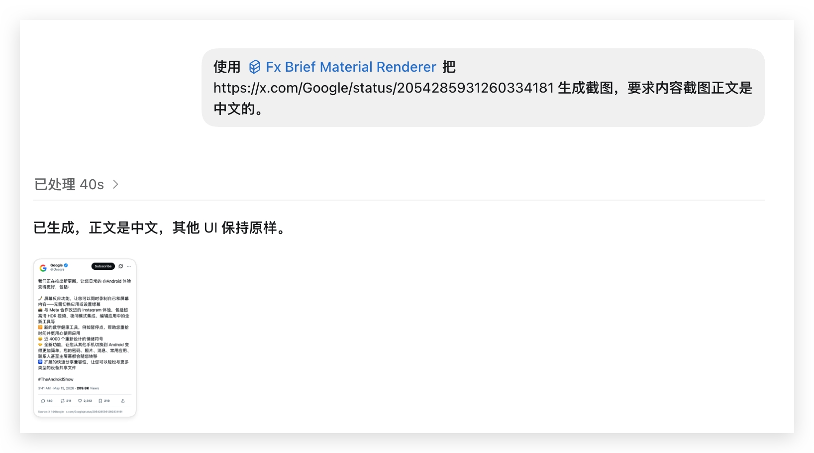

# Matt Skills

[English](README.md) | [简体中文](README.zh-CN.md)

`matt-skills` 是一个面向创作者工作流的多 skills + 多 CLI 统一仓库。这里集中放 Codex skill 指令、确定性辅助脚本、npm 包、示例和文档。

## 功能模块

| 模块 | 入口 | 类型 | 能做什么 | 文档 |
| --- | --- | --- | --- | --- |
| X / FxBrief | `matt-fx-brief-material-renderer` | Codex skill | 把 X/Twitter 推文和 X 长文变成本地新闻/创作素材。 | [EN](docs/fx-brief/README.md) / [中文](docs/fx-brief/README.zh-CN.md) |
| X / FxBrief | `fxbrief` | npm CLI | 基于 FxEmbed 数据生成推文截图、媒体引用卡、长文 Markdown 和长截图。 | [EN](docs/fx-brief/README.md) / [中文](docs/fx-brief/README.zh-CN.md) |
| Image Grab | `matt-pic-grab-image` | Codex skill + Bun 脚本 | 查找并缓存版权链路清楚的图片，保留来源、作者、授权和风险元数据。 | [EN](docs/pic-grab-image/README.md) / [中文](docs/pic-grab-image/README.zh-CN.md) |

## X / FxBrief

当你需要从 X/Twitter 生成可发布素材，同时不想依赖第三方截图页面时，使用 `matt-fx-brief-material-renderer`。它会调用已发布的 `fxbrief` CLI，通过 FxEmbed 获取数据，用本地 React/HTML 模板和 Playwright 完成渲染截图。

核心工作流：

| 命令 | 输出 |
| --- | --- |
| `post-mobile` | 430px 移动端 X 风格截图，适合新闻引用源。 |
| `post-clean` | 媒体报道引用卡，保留来源信息，同时降低“官方截图”的观感。 |
| `article-md` | X 长文导出：`article.md`、`assets/`、`metadata.json`，以及可选 raw FxEmbed 数据。 |
| `article-shot` | X 长文长截图，可输出适合社交平台的编号切片。 |

| 案例 |
| --- |
| 使用 `$matt-fx-brief-material-renderer` 把 `https://x.com/Google/status/2054285931260334181` 生成截图，要求截图正文是中文的。 |
|  |
|  |

详细安装、案例、命令参数、输出结构和截图展示：

- [FxBrief guide in English](docs/fx-brief/README.md)
- [FxBrief 中文教程](docs/fx-brief/README.zh-CN.md)

## Image Grab

当你需要给封面、文章配图、演示稿、社交媒体或背景图找素材，并希望保留清晰的来源链路时，使用 `matt-pic-grab-image`。默认模式优先选择 CC0 / Public Domain 来源，不会把 Pexels、Pixabay、Unsplash 这类平台授权误写成 CC0。

| 案例 |
| --- |
| 使用 `$matt-pic-grab-image` 给我一张“山水”主题图片，要求免费商用、无需署名、可二改。 |
|  |

直接脚本示例：

```bash
bun run skills/matt-pic-grab-image/scripts/grab-image.ts \
  --query "山水" \
  --fallback-query "Chinese landscape painting" \
  --mode strict_cc0 \
  --orientation landscape \
  --count 1
```

详细安装、案例、来源策略、脚本参数和输出字段：

- [Pic Grab Image guide in English](docs/pic-grab-image/README.md)
- [Pic Grab Image 中文教程](docs/pic-grab-image/README.zh-CN.md)

## 手动安装 Skill

安装后重启 Codex，让它发现新 skill。

从 GitHub 安装：

```text
$skill-installer install https://github.com/mate-matt/matt-skills/tree/main/skills/matt-fx-brief-material-renderer
$skill-installer install https://github.com/mate-matt/matt-skills/tree/main/skills/matt-pic-grab-image
```

如果已经 clone 到本地，也可以手动安装：

```bash
mkdir -p "${CODEX_HOME:-$HOME/.codex}/skills"
ln -s "$PWD/skills/matt-fx-brief-material-renderer" "${CODEX_HOME:-$HOME/.codex}/skills/matt-fx-brief-material-renderer"
ln -s "$PWD/skills/matt-pic-grab-image" "${CODEX_HOME:-$HOME/.codex}/skills/matt-pic-grab-image"
```

## 开发

```bash
npm --prefix packages/fxbrief install
bun run fxbrief:typecheck
bun run fxbrief:test
bun run fxbrief:build
bun run validate:skills
```

渲染 fixture：

```bash
bun run fxbrief:render:fixture
```

预览 npm 包内容：

```bash
bun run fxbrief:pack
```

## 发布说明

如果要发布 `@mate-matt/fxbrief`，你需要拥有能控制 `@mate-matt` organization scope 的 npm 账号。公开 scoped package 发布命令是：

```bash
cd packages/fxbrief
npm publish --access public
```

npm 官方文档：<https://docs.npmjs.com/creating-and-publishing-scoped-public-packages/>

## License

本仓库代码使用 MIT License。第三方图片、X/Twitter 内容和 FxEmbed 返回数据不由本仓库授权；发布时请保留来源链接，并根据具体使用场景复核权利风险。
