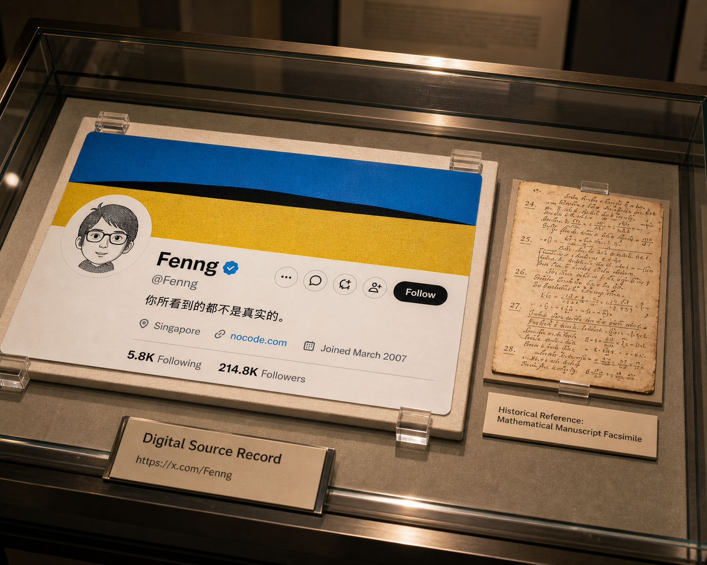

# Matt X Poster

`matt-x-poster` 可以把真实的 X/Twitter 个人主页、推文或 X Article 链接转成电影感海报提示词。它通过 FxEmbed 获取真实数据，把事实内容保存在 `card-context.json`，再按指定风格组装 imagegen prompt，并在收尾阶段用当前 X 头像做头像-only 替换。

## 快速开始

在 Codex 里用 X 链接和风格调用：

```text
$matt-x-poster --style sunlit-sail-signal https://x.com/user/status/123
```

skill 内部主要跑两个确定性脚本：

```bash
bun run skills/matt-x-poster/scripts/x-card-data.ts prepare "<x-url-or-handle>" --out output/matt-x-poster/<slug>

bun run skills/matt-x-poster/scripts/compose-prompt.ts \
  --context output/matt-x-poster/<slug>/card-context.json \
  --style <style-name> \
  --out output/matt-x-poster/<slug>/final-prompt.md
```

首轮图生成后，只要存在本地 X 头像且当前风格会渲染作者/主页头像，skill 会固定执行 Avatar Finalization Pass：只替换圆形头像区域为当前 X 头像参考图，其它文字、布局、材质、光影和媒体内容都不动。

## 示例

下面是由公开 X 内容生成的示例图。它们只用于展示生成效果；源 X 内容和第三方媒体不由本仓库授权。

| 风格 | 示例 |
| --- | --- |
| `--style lunar-flag-signal` |  |
| `--style seaside-plein-air-wave` |  |
| `--style museum-archive-case` |  |
| `--style takeout-receipt-counter` |  |
| `--style profile-portal-3d` |  |

## 风格表

固定风格都对应 `skills/matt-x-poster/prompts/` 下的文件。

| 使用参数 | Prompt 文件 | 适合场景 |
| --- | --- | --- |
| `--style profile-portal-3d` | `profile-portal-3d.md` | 3D X 主页/推文传送门、漂浮玻璃卡、创作者视觉卡。 |
| `--style creator-signal-stage` | `creator-signal-stage.md` | 发布会、工作室、咖啡馆、展示板等发布现场。 |
| `--style seaside-plein-air-wave` | `seaside-plein-air-wave.md` | 海边画架、写实沙滩、巨浪中的内容回声。 |
| `--style sunlit-sail-signal` | `sunlit-sail-signal.md` | 阳光海面、帆船、把 X 内容印在帆布上的写实海报。 |
| `--style editorial-citation-desk` | `editorial-citation-desk.md` | 编辑桌、打开的书、引用卡、资料来源视觉。 |
| `--style street-poster-wheatpaste` | `street-poster-wheatpaste.md` | 城市墙面、wheatpaste 海报、街头纸张纹理。 |
| `--style museum-archive-case` | `museum-archive-case.md` | 博物馆玻璃柜、档案盒、被保存的数字来源卡。 |
| `--style creator-field-notes` | `creator-field-notes.md` | 研究桌、笔记本、资料研读、创作者档案。 |
| `--style cinematic-contact-sheet` | `cinematic-contact-sheet.md` | 胶片、暗房接触印相、导演选片和编辑审片。 |
| `--style designer-pinboard` | `designer-pinboard.md` | 情绪板、软木板/布板、身份系统、色板研究。 |
| `--style skin-script-body-art` | `skin-script-body-art.md` | 克制的身体文字、时装/editorial 人像构图。 |
| `--style bathroom-mirror-sticky-note` | `bathroom-mirror-sticky-note.md` | 浴室镜子、便利贴、晨间提醒式幽默。 |
| `--style fridge-door-magnet` | `fridge-door-magnet.md` | 厨房冰箱、磁贴、购物清单、家庭日历式幽默。 |
| `--style elevator-notice-board` | `elevator-notice-board.md` | 电梯/大厅公告栏、公共建筑通知、贴纸/塑封公告。 |
| `--style laundromat-machine-note` | `laundromat-machine-note.md` | 自助洗衣店、洗衣机门贴、折衣桌纸条。 |
| `--style takeout-receipt-counter` | `takeout-receipt-counter.md` | 咖啡/外卖柜台、收据、小票、纸袋标签。 |
| `--style grand-opera-chorus` | `grand-opera-chorus.md` | 歌剧院舞台、节目册、唱诗班式高文化幽默。 |
| `--style lunar-flag-signal` | `lunar-flag-signal.md` | 月球 EVA、宇航员、把 X 内容印在月面旗帜上。 |

运行时风格按每次任务生成：

| 使用参数 | 运行时文件 | 适合场景 |
| --- | --- | --- |
| `--style dynamic` | `output/matt-x-poster/<slug>/dynamic-style.md` | 为单条内容临时设计一个专属视觉结构。 |
| `--style film-dynamic` | `output/matt-x-poster/<slug>/film-dynamic-style.md` | 借用经典电影场景机制，但不复制受保护画面、演员或角色。 |

## 开源前检查

- 默认不要把 `output/matt-x-poster/` 里的完整运行目录发布出去，除非你已经人工挑选过。
- 不要提交私有链接生成的 `card-context.json`、raw FxEmbed payload、本地头像路径或完整生成 prompt。
- 发布文档图前，检查图里是否有公开 handle、邮箱、URL、来源归属等信息，并确认这些内容可以公开展示。
- 本仓库代码是 MIT License；X 内容、头像和附带媒体仍归原权利方所有。
