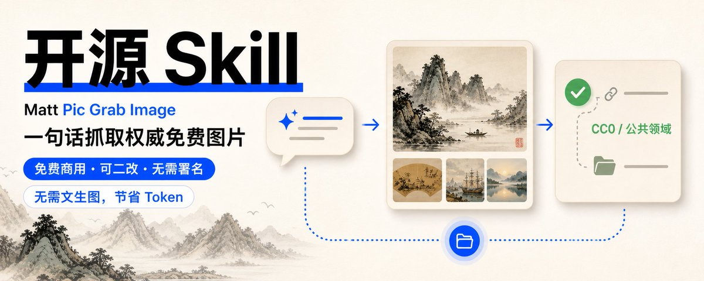
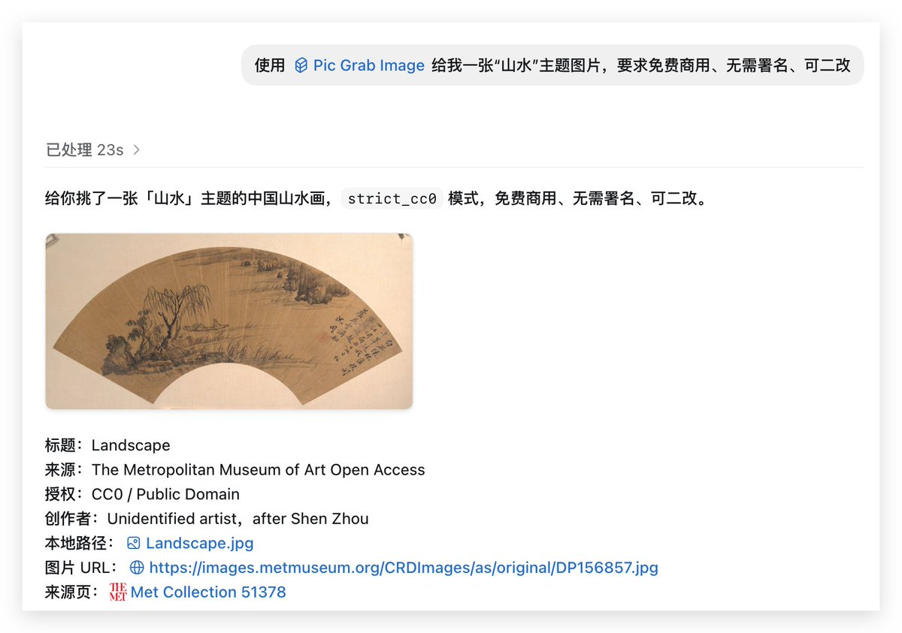
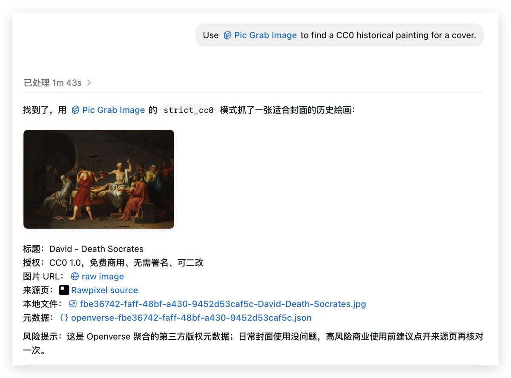
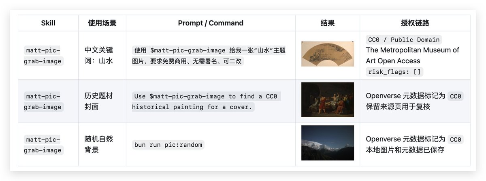

# 疯狂 Builder 第 1 期：我把“安全拿图”做成了一个 Skill，帮你节省不必要的文生图 Token



GPT Image 2 让大家文生图成瘾，其实**不是所有图片都需要文生图。**很多时候，我们只是需要一张：

- 文章封面图
- 推文长截图背景
- 公众号配图
-  Notion / 博客头图
- AI 教程里的视觉缓冲图

这类图不一定要从 0 生成。网上已经有很多公开的高质量图片来源，里面有大量免费、可商用、可修改的图片，而且很多来源本身就提供 API。

- Openverse：可以按 license 筛 CC0
- Smithsonian Open Access：CC0 开放馆藏
- Pexels / Pixabay：现代图库审美强，但要注意它们不是 CC0，而是平台 License

但是自己手动筛选搜图很麻烦，所以我构建一个 skill，让你一句话搞定精准搜图，并自动下载，结果还带元数据，并且免费，可商用，可二改。

## matt-pic-grab-image skill 帮你自动实现

直接上使用案例，保证看完后你就迫不及待的去 github 点 start 去了：



[点我，去 Github 开源仓库点 start。](https://github.com/mate-matt/matt-skills)

## 丰富的元信息方便接入其他流程、并且提醒版权问题

结果中自带元数据：标题，来源，授权，创作者等元信息。方便将 skill 接入其他流程中进行二次创作。



如图，该图片信息明确提示 Openverse 是聚合元数据，不是法律担保。普通内容创作够用了。如果是广告、商品包装、大规模商业使用，就打开 source_url 再复核一次。辅助商业化行为中进行合理的处理版权。

## **内容创作的好伙伴**

很多内容创作里，图片需求大概可以分两类。

第一类是「必须生成」：例如不存在的画面、你要统一品牌风格、你要特殊构图，这种当然适合文生图。

第二类是「找到就行」：山水、历史画、星空、森林、植物插画、博物馆藏品、抽象纹理；这种如果每次都用文生图，其实有点浪费。除了浪费钱，还有等待时间， prompt 调参，版权等问题；并且后续复用时找不到出处。

公开图库里已经有很多好图，直接搜索、筛选、缓存、引用，反而更稳。对内容创作者来说，这可能比多生成一张“看起来不错但说不清来源”的图更有价值。

## 疯狂 Builder 系列第一期

最近我在疯狂使用 codex 进行构建，简直沉迷其中，把 codex building 当做了像钓鱼一样的乐趣了。总结了一下，我已经构建了起码 10 多个大大小小的工具，很多都在自己的工作流程中发挥这作用。

所以，后续计划不断的开源，或者分享自己的构建过程和产品，欢迎大家关注我，一起讨论 codex building。

## **开源** 

**Github:** https://github.com/mate-matt/matt-skills 

**Codex 推荐安装方式：**

```shell
$skill-installer install https://github.com/mate-matt/matt-skills/tree/main/skills/matt-pic-grab-image
```

安装后重启 Codex，让它发现新 Skill。如果你已经把仓库 clone 到本地，也可以手动安装(需要本机安装 Bun)：

```shell
mkdir -p "${CODEX_HOME:-$HOME/.codex}/skills"
ln -s "$PWD/skills/matt-pic-grab-image" "${CODEX_HOME:-$HOME/.codex}/skills/matt-pic-grab-image"

```

**用 Codex 调用**

> 使用 $matt-pic-grab-image 给我一张“山水”主题图片，要求免费商用、无需署名、可二改

> Use $matt-pic-grab-image to find a CC0 history painting for an article cover.

> 使用 $matt-pic-grab-image 随机找一张可商用的自然风景背景图，并保存本地

Codex 会自动决定关键词 fallback、数据源顺序和返回说明。中文关键词会保留原文，同时补一个英文 fallback，提高命中率。

**也可以直接命令行使用**

```shell
bun run skills/matt-pic-grab-image/scripts/grab-image.ts \
  --query "山水" \
  --fallback-query "Chinese landscape painting" \
  --mode strict_cc0 \
  --provider met,openverse \
  --orientation landscape \
  --count 1 \
  --seed shanshui-commercial-safe
```

更多细节，可前往 github 开源仓库



[点我，去 Github 开源仓库点 start。](https://github.com/mate-matt/matt-skills)
